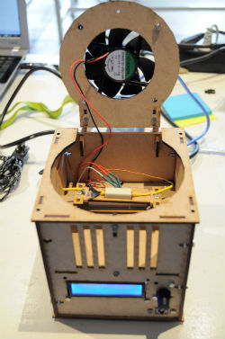

#BHA Thermocycler

This repo contains the designs and source files of a **DIY Thermocycler**. This device can be used to perform a polymerase chain reaction on DNA. Check out the corresponding [BHA lecture in the Syllabus](http://biohackacademy.github.io) for more information.

##Navigating the repo

 	BHA_Thermocyler/					main repo
 	|-- Arduino Code/Thermocycler/		Arduino Code
 	|-- Assembly/						Electronics assembly guide
 	|-- Pictures/						Photo documentation
 	BoM.md								Bill of Materials
 	Thermocycler-Cut-Sheet-Nested.svg	Nested laser cut vector file
 	Thermocycler-Cut-Sheet.svg			Laser cut vector file
 	Thermocycler-Fritzing.fzz			Wiring Scheme
 	Thermocycler-Sketchup.skp			Sketchup 3D design
 	
##Releases

The BioHack Academy 3 release contains the following:

* 2015 BHA1 Design
* 2015 BHA2 Design
* 2016 BHA3 Design

## To Do

The To Do's are tracking using the Issues section of this GitHub Repo.

Please make more suggestions by posting there.

## License

All code is licensed under GNU General Public License.

All designs are licensed under Creative Commons Contribution Share-Alike license

Copyright Waag Society